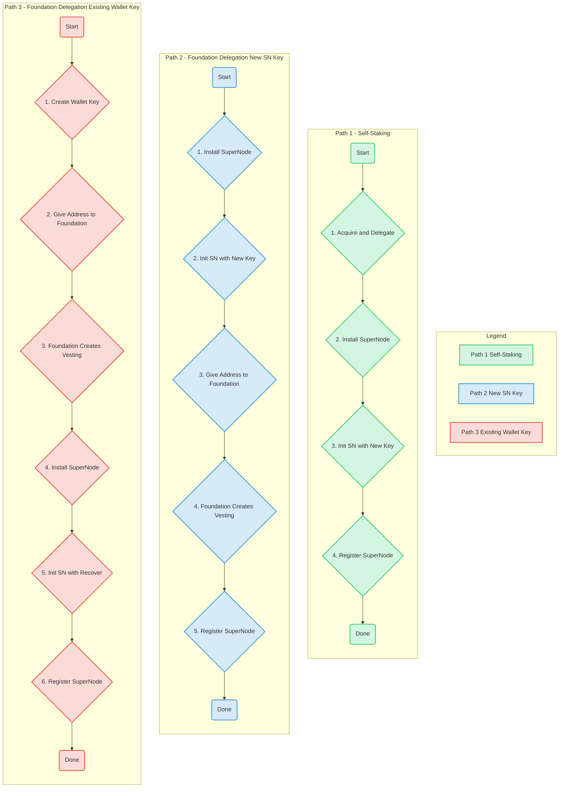

# Lumera SuperNode Operator Guide

> Scope update (July 2025) – This revision aligns the guide with the latest `supernode init` command defaults and the new dual‑source stake validation flow. Follow it exactly to avoid registration failures.

---

## Introduction

This guide provides three distinct, non-interchangeable paths to install, configure, and register a Lumera SuperNode. Each path corresponds to a different staking and key management strategy.

A SuperNode is always linked to a **Validator**. You must have an existing, bonded validator before proceeding. The registration transaction is always sent from the validator's host and signed by the validator's operator key.

### SuperNode Setup Paths


> **Note:** If the diagram above does not render correctly, you can copy the code into a [Mermaid Live Editor](https://mermaid.live) to view it.

---

## Prerequisites

### 1. Validator
Your validator must already be installed, configured, and in `BOND_STATUS_BONDED`. If you don’t have one yet, complete the Validator Guide first.

### 2. System Requirements
| Component | Minimum | Recommended |
| --- | --- | --- |
| **CPU** | 8 vCPU | 16 vCPU |
| **RAM** | 16 GB | 64 GB |
| **Storage** | 1 TB NVMe | 4 TB NVMe |
| **Network** | 1 Gbps | 5 Gbps |
| **OS** | Ubuntu 22.04 LTS+ | Same |

Firewall: Open inbound **4444/tcp** (gRPC API) and **4445/tcp** (P2P) on the SuperNode host.

### 3. Install SuperNode Binary
On your dedicated SuperNode host, install the binary:
```bash
sudo curl -L -o /usr/local/bin/supernode \
  https://github.com/LumeraProtocol/supernode/releases/latest/download/supernode-linux-amd64
sudo chmod +x /usr/local/bin/supernode
supernode version
```

---

## Path 1: Self-Staking

This path is for validators who meet the minimum stake requirement through their own self-delegated tokens.

### Step 1. Acquire and Delegate Tokens
1.  Acquire the required amount of LUME tokens.
2.  Send them to your validator's operator address (`<val_key>`).
3.  Delegate the tokens to your own validator from that same address.

```bash
# Check your validator's operator address
VALOPER=$(lumerad keys show <val_key> --bech val -a)

# Delegate to meet the minimum stake
lumerad tx staking delegate $VALOPER <amount>ulume --from <val_key> --gas auto --fees 5000ulume --chain-id lumera-mainnet-1
```

### Step 2. Initialize SuperNode with a New Key
On the SuperNode host, run the `init` command. This will create a **brand-new key** for the SuperNode.

```bash
supernode init --key-name mySNKey --chain-id lumera-mainnet-1
```
**Important:** Securely back up the mnemonic phrase displayed. This key is now your SuperNode's identity.

### Step 3. Register the SuperNode
Go back to your **validator host**. The registration transaction must be signed by your validator's operator key (`<val_key>`) and include the new SuperNode address created in the previous step.

```bash
# On Validator Host
VALOPER=$(lumerad keys show <val_key> --bech val -a)
SN_ENDPOINT="<sn_ip>:4444"
SN_ACCOUNT="$(supernode keys show mySNKey -a --home /path/to/.supernode)" # Get address from SN host

lumerad tx supernode register-supernode \
  $VALOPER $SN_ENDPOINT $SN_ACCOUNT \
  --from <val_key> --chain-id lumera-mainnet-1 \
  --gas auto --fees 5000ulume
```

---

## Path 2: SuperNode Delegation with New Key

This path is for operators who will receive a delegation from the Foundation to a **brand-new address** created by the `supernode` binary.

### Step 1. Initialize SuperNode with a New Key
On the SuperNode host, run the `init` command to create a new key and configuration.

```bash
supernode init --key-name mySNKey --chain-id lumera-mainnet-1
```
**Action:**
1.  Follow the prompts.
2.  **Securely back up the mnemonic phrase.**
3.  **Copy the new address** that is generated.

### Step 2. Provide Address to Foundation
Give the new SuperNode address (e.g., `lumera1...`) to the Lumera Foundation. The Foundation will use this address to create a delayed vesting account with the required delegation amount.

**Wait for confirmation** from the Foundation that the vesting account has been created and funded. The address must have an on-chain account before you can proceed.

### Step 3. Register the SuperNode
Once the vesting account is live, go to your **validator host** and run the registration command. This command associates your validator with the new, Foundation-funded SuperNode address.

```bash
# On Validator Host
VALOPER=$(lumerad keys show <val_key> --bech val -a)
SN_ENDPOINT="<sn_ip>:4444"
SN_ACCOUNT="<the_new_supernode_address_from_step_1>"

lumerad tx supernode register-supernode \
  $VALOPER $SN_ENDPOINT $SN_ACCOUNT \
  --from <val_key> --chain-id lumera-mainnet-1 \
  --gas auto --fees 5000ulume
```

---

## Path 3: SuperNode Delegation with Existing Key

This path is for operators who want to use a key from an existing crypto wallet (e.g., Keplr, Leap) that has **never been used on-chain**.

### Step 1. Generate and Store a New Key in a Wallet
1.  Using a trusted wallet like Keplr, create a **brand-new account**.
2.  **This address must not have any transaction history.** It must be a fresh, unused address.
3.  **Securely back up the mnemonic phrase** provided by the wallet.

### Step 2. Provide Address to Foundation
Give the new, unused wallet address to the Lumera Foundation. The Foundation will create a delayed vesting account for this address.

**Wait for confirmation** that the vesting account is live.

### Step 3. Initialize SuperNode with `--recover`
On the SuperNode host, run the `init` command with the `--recover` flag. This will prompt you to enter the mnemonic phrase from the wallet you created in Step 1.

```bash
supernode init --key-name myWalletSNKey --recover --chain-id lumera-mainnet-1
```
This imports your wallet key into the SuperNode's keyring, ensuring the SuperNode and the on-chain vesting account are controlled by the same key.

### Step 4. Register the SuperNode
Return to your **validator host** and run the registration command, pointing to the address you imported.

```bash
# On Validator Host
VALOPER=$(lumerad keys show <val_key> --bech val -a)
SN_ENDPOINT="<sn_ip>:4444"
SN_ACCOUNT="<the_wallet_address_from_step_1>"

lumerad tx supernode register-supernode \
  $VALOPER $SN_ENDPOINT $SN_ACCOUNT \
  --from <val_key> --chain-id lumera-mainnet-1 \
  --gas auto --fees 5000ulume
```

---

## Common Operations

### Run SuperNode as a Service
This `systemd` service file ensures your SuperNode runs reliably. **First, replace `<YOUR_USER>` in the two places below with your actual Linux username.**

```bash
# Replace <YOUR_USER> before running
sudo tee /etc/systemd/system/supernode.service <<EOF
[Unit]
Description=Lumera SuperNode
After=network-online.target

[Service]
User=<YOUR_USER>
ExecStart=/usr/local/bin/supernode start --home /home/<YOUR_USER>/.supernode
Restart=on-failure
RestartSec=5
LimitNOFILE=65536

[Install]
WantedBy=multi-user.target
EOF
```

After creating the file, run the following commands, again replacing `<YOUR_USER>` with your username.
```bash
sudo systemctl daemon-reload
sudo systemctl enable --now supernode@<YOUR_USER>
journalctl -u supernode@<YOUR_USER> -f
```

### Verify Registration
Check the status of your SuperNode on-chain:
```bash
lumerad q supernode get-super-node $VALOPER --node https://rpc.lumera.io:443
```
The status should be `ACTIVE`. If you see `INSUFFICIENT_STAKE`, double-check your delegations.

---

## Tips and More

### Security Best Practices
- **Separate Hosts**: Never run a validator and a SuperNode on the same machine.
- **OS Keyring**: The default `os` keyring backend is recommended for production as it leverages secure system credential storage.
- **Backups**: Keep secure, offline backups of your validator's `priv_validator_key.json` and the mnemonic phrases for both your validator and SuperNode keys.

### Troubleshooting
| Symptom | Likely Cause | Fix |
| --- | --- | --- |
| `ELIGIBILITY_FAILED` on registration | Combined stake < minimum | Verify delegations for the correct addresses. |
| SuperNode stuck `DISABLED` | Validator fell out of active set **and** stake below threshold | Add stake or wait for the validator to re-enter the active set. |
| gRPC errors in logs | Wrong `lumera.grpc_addr` in `~/.supernode/config.yml` | Point to a trusted public node or your own gRPC endpoint. |

---

© 2025 Lumera Protocol – Guide version 2.0
