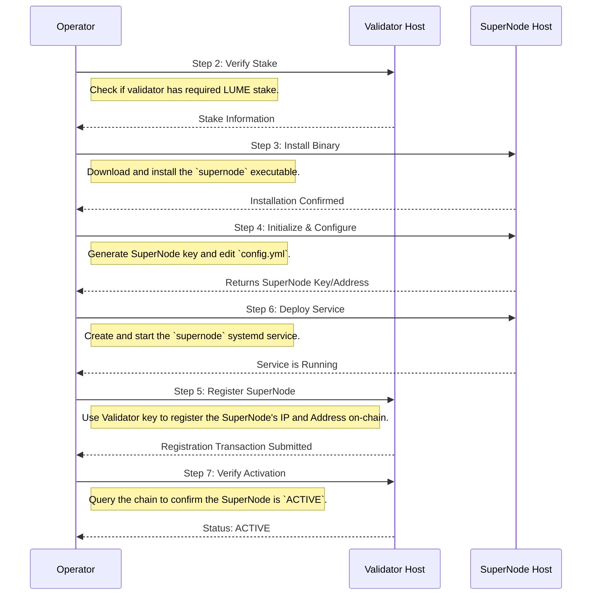

# Lumera SuperNode Operator Guide

## Introduction

This guide provides comprehensive instructions for validator operators who wish to deploy and manage a SuperNode on the Lumera Protocol. SuperNodes provide additional services (storage, AI processing, and other network services) alongside standard block validation and earn **Proof-of-Service (PoSe)** rewards in parallel with PoS staking rewards.

> **Important:** Each validator may attach **exactly one** SuperNode.

---

## Pre-flight Checklist

Gather the following information before starting:

- [ ] SuperNode host public IP address
- [ ] Access to validator host (for registration commands)

---

## Step 1: Prerequisites

### System Requirements

Ensure your SuperNode host meets the following minimum requirements:

| Component | Minimum | Recommended | Notes |
|-----------|---------|-------------|-------|
| **CPU** | 8 × vCPU | 16 × vCPU | x86_64 architecture |
| **RAM** | 16 GB | 64 GB | For service processing |
| **Storage** | 1 TB NVMe | 4 TB NVMe | High-speed storage required |
| **Network** | 1 Gbps | 5 Gbps | Stable internet connection |
| **OS** | Ubuntu 22.04 LTS+ | Ubuntu 22.04 LTS+ | Install `build-essential` |

### Network Requirements

Your SuperNode host must have the following ports open for inbound traffic:
- **Port 4444** (gRPC/API)
- **Port 4445** (P2P) - **Do not change this port**

### Validator Prerequisites

Before proceeding, ensure:
- ✅ Your validator is running and operational.
- ✅ Your validator has the required self-stake:
  - Mainnet - **≥ 25,000 LUME** self-staked
  - Testnet - **≥ 10,000 LUME** self-staked
- ✅ You have access to your validator signing keys.
- ✅ Your validator is either in the active set OR meets the self-stake requirement.

> **Note:** The SuperNode and validator can (and should) run on separate servers for enhanced security and performance.

---

## Step 2: Validator Stake Verification

**Host:** Validator Host

Verify that your validator meets the minimum staking requirements.

### Check Current Validator Stake

```bash
# Replace <your_validator_key_name> with your actual validator key name
VALOPER=$(lumerad keys show <your_validator_key_name> --bech val -a)
echo "Validator Address: $VALOPER"

# Check current validator status and stake
lumerad q staking validator $VALOPER
```

**Verify Requirements:**
- Look for the `tokens` field in the output and confirm `status: BOND_STATUS_BONDED`.
- Ensure the stake meets the minimum:
  Mainnet Stake ≥ `25000000000000` (25,000 LUME in ulume)
  Testnet Stake ≥ `10000000000000` (10,000 LUME in ulume)
  
> **Note:** If commands fail, you may need to add the `--keyring-backend <backend>` flag matching your validator's keyring configuration (e.g., `file`, `os`, `test`).

### Add Additional Stake (if required)

If your validator needs more stake:
<details>
<summary><strong>Mainnet Example</strong></summary>

```bash
# Delegate additional stake. Example: Adding 5,000 LUME (5000000000000ulume)
lumerad tx staking delegate $VALOPER 5000000000000ulume \
  --from <your_validator_key_name> \
  --chain-id lumera-mainnet-1 \
  --gas auto --fees 5000ulume
```
</details>
<details open>
<summary><strong>Testnet Example</strong></summary>

```bash
# Delegate additional stake. Example: Adding 1,000 LUME (1000000000000ulume)
lumerad tx staking delegate $VALOPER 1000000000000ulume \
  --from <your_validator_key_name> \
  --chain-id lumera-testnet-2 \
  --gas auto --fees 1000ulume
```
</details>

---

## Step 3: Install SuperNode Binary

**Host:** SuperNode Host

Download and install the latest SuperNode binary.

```bash
# Download the SuperNode binary
sudo curl -L \
  -o /usr/local/bin/supernode \
  https://github.com/LumeraProtocol/supernode/releases/latest/download/supernode-linux-amd64

# Make it executable
sudo chmod +x /usr/local/bin/supernode

# Verify installation
supernode version
```

> **NOTE:** If you get error
> ```bash
> supernode: error while loading shared libraries: libwebp.so.7: cannot open shared object file: No such file or directory
> ```
> Run this command:
> ```bash
> sudo apt install libwebp-dev -y
> ```

---

## Step 4: Initialize SuperNode Configuration

**Host:** SuperNode Host

#### Option A: Initialize and Create a New Key
<details>
<summary><strong>Mainnet</strong></summary>

```bash
supernode init <your_supernode_key_name> --chain-id lumera-mainnet-1
```
</details>
<details open>
<summary><strong>Testnet</strong></summary>

```bash
supernode init <your_supernode_key_name> --chain-id lumera-testnet-2
```
</details>

> **Security:** Store your mnemonic phrase and keyring password securely. They are required for key recovery.

#### Option B: Recover an Existing Key
<details>
<summary><strong>Mainnet</strong></summary>

```bash
supernode init <your_supernode_key_name> --recover --mnemonic "<your_24_word_mnemonic_phrase>" --chain-id lumera-mainnet-1
```
</details>
<details open>
<summary><strong>Testnet</strong></summary>

```bash
supernode init <your_supernode_key_name> --recover --mnemonic "<your_24_word_mnemonic_phrase>" --chain-id lumera-testnet-2
```
</details>

> **Important:** After initializing, ensure the new SuperNode account address has funds for gas fees.

### Edit Configuration File

The `supernode init` command creates a configuration file at `~/.supernode/config.yml`. Verify its contents.
<details>
<summary><strong>Mainnet Configuration</strong></summary>

```yaml
supernode:
  key_name: <your_supernode_key_name>
  identity: "<your_supernode_lumera_address>"
  ip_address: 0.0.0.0
  port: 4444
keyring:
  backend: file
  dir: keys
p2p:
  listen_address: 0.0.0.0
  port: 4445
  data_dir: data/p2p
  external_ip: ""
lumera:
  grpc_addr: "localhost:9090"
  chain_id: "lumera-mainnet-1"
raptorq:
  files_dir: raptorq_files
```
</details>
<details open>
<summary><strong>Testnet Configuration</strong></summary>

```yaml
supernode:
  key_name: <your_supernode_key_name>
  identity: "<your_supernode_lumera_address>"
  ip_address: 0.0.0.0
  port: 4444
keyring:
  backend: file
  dir: keys
p2p:
  listen_address: 0.0.0.0
  port: 4445
  data_dir: data/p2p
  external_ip: ""
lumera:
  grpc_addr: "localhost:9090"
  chain_id: "lumera-testnet-2"
raptorq:
  files_dir: raptorq_files
```
</details>

> **NOTE**:<br/>
> For gRPC endpoint (`lumera.grpc_addr) you can use either:
>  * `localhost:9090` - for locally installed `lumerad` (*default*)
>  * `https://grpc.lumera.io` - for **mainnet**
>  * `https://grpc.testnet.lumera.io` - for **testnet**

---

## Step 5: SuperNode Registration

**Host:** Validator Host

Register your SuperNode on-chain. This must be done from your **validator host** after your SuperNode service is running.

### Execute Registration Transaction
<details>
<summary><strong>Mainnet</strong></summary>

```bash
VALIDATOR_KEY_NAME=<your_validator_key_name>
VALOPER=$(lumerad keys show $VALIDATOR_KEY_NAME --bech val -a --keyring-backend <file|os|test>)
SUPERNODE_ENDPOINT="<your_supernode_public_ip>:4444"
SUPERNODE_ACCOUNT="<your_supernode_lumera_address>"

lumerad tx supernode register-supernode \
  $VALOPER \
  $SUPERNODE_ENDPOINT \
  $SUPERNODE_ACCOUNT \
  --from $VALIDATOR_KEY_NAME \
  --chain-id lumera-mainnet-1 \
  --gas auto \
  --gas-adjustment 1.3 \
  --fees 5000ulume \
  --keyring-backend <file|os|test>
```
</details>
<details open>
<summary><strong>Testnet</strong></summary>

```bash
VALIDATOR_KEY_NAME=<your_validator_key_name>
VALOPER=$(lumerad keys show $VALIDATOR_KEY_NAME --bech val -a --keyring-backend <file|os|test>)
SUPERNODE_ENDPOINT="<your_supernode_public_ip>:4444"
SUPERNODE_ACCOUNT="<your_supernode_lumera_address>"

lumerad tx supernode register-supernode \
  $VALOPER \
  $SUPERNODE_ENDPOINT \
  $SUPERNODE_ACCOUNT \
  --from $VALIDATOR_KEY_NAME \
  --chain-id lumera-testnet-2 \
  --gas auto \
  --gas-adjustment 1.3 \
  --fees 1000ulume \
  --keyring-backend <file|os|test>
```
</details>

---

## Step 6: SuperNode Service Deployment

**Host:** SuperNode Host

### Create Systemd Service

Create a `systemd` service file for automatic SuperNode management.

```bash
sudo tee /etc/systemd/system/supernode.service <<EOF
[Unit]
Description=Lumera SuperNode
After=network-online.target

[Service]
User=$(whoami)
ExecStart=/usr/local/bin/supernode start -d /home/$(whoami)/.supernode
Restart=on-failure
RestartSec=5
LimitNOFILE=65536

[Install]
WantedBy=multi-user.target
EOF
```

### Start SuperNode Service

```bash
# Reload systemd configuration
sudo systemctl daemon-reload

# Enable and start the service for the current user
sudo systemctl enable --now supernode.service

# Monitor service logs
journalctl -u supernode.service -f
```

---

## Step 7: Verification and Monitoring

### Verify SuperNode Status

**Host:** Validator Host

Check your SuperNode registration and operational status.
<details>
<summary><strong>Mainnet</strong></summary>

```bash
VALIDATOR_KEY_NAME=<your_validator_key_name>
VALOPER=$(lumerad keys show $VALIDATOR_KEY_NAME --bech val --keyring-backend <file|os|test>)
lumerad q supernode get-super-node $VALOPER --node https://rpc.lumera.io
```
</details>
<details open>
<summary><strong>Testnet</strong></summary>

```bash
VALIDATOR_KEY_NAME=<your_validator_key_name>
VALOPER=$(lumerad keys show $VALIDATOR_KEY_NAME --bech val -a --keyring-backend <file|os|test>)
lumerad q supernode get-super-node $VALOPER --node https://rpc.testnet.lumera.io
```
</details>

You should see the `state` field as `ACTIVE`.

### Monitor SuperNode Operations

**Host:** SuperNode Host

```bash
# Monitor real-time logs
journalctl -u supernode@$(whoami) -f

# Check service status
sudo systemctl status supernode@$(whoami)
```

---

## Step 8: Security Best Practices

### Infrastructure Security
- **🏠 Separate Hosting**: Deploy SuperNode on a different server than the validator.
- **🔥 Network Security**: Implement firewall rules to allow only necessary ports (4444, 4445).
- **🔐 Key Management**: Use secure keyring backends (`os` or HSM) for production.

### Backup Requirements
**Critical Files to Backup:**
- The entire `~/.supernode/` directory (contains `config.yml`, keyring files, and operational data).

> **Tip:** Regularly back up the `~/.supernode/` directory to prevent data loss.

---

## Troubleshooting

| Issue | Symptom | Solution | Host |
|-------|---------|----------|------|
| **Registration Failure** | `insufficient funds` error | Ensure validator account has LUME for gas fees. | Validator Host |
| **Connection Issues** | SuperNode not reaching `ACTIVE` state | Verify ports 4444 and 4445 are open and accessible. | SuperNode Host |
| **Key Errors** | Authentication failures | Add `--keyring-backend <type>` to commands. | Validator Host |
| **Sync Issues** | SuperNode stuck at startup | Check `grpc_addr` connectivity in `config.yml`. | SuperNode Host |

---

## SuperNode Setup Workflow

The following diagram illustrates the high-level steps required to set up and register a SuperNode.


